# Bamazon
Welcome to Bamazon, a marketplace application that allows users to purchase a variety of items. There are two "views": customer view and manager view. Each view has different functions.

## Customer View
As a customer, Bamazon allows you to view the items that are for sale. When prompted, the application will display available items:
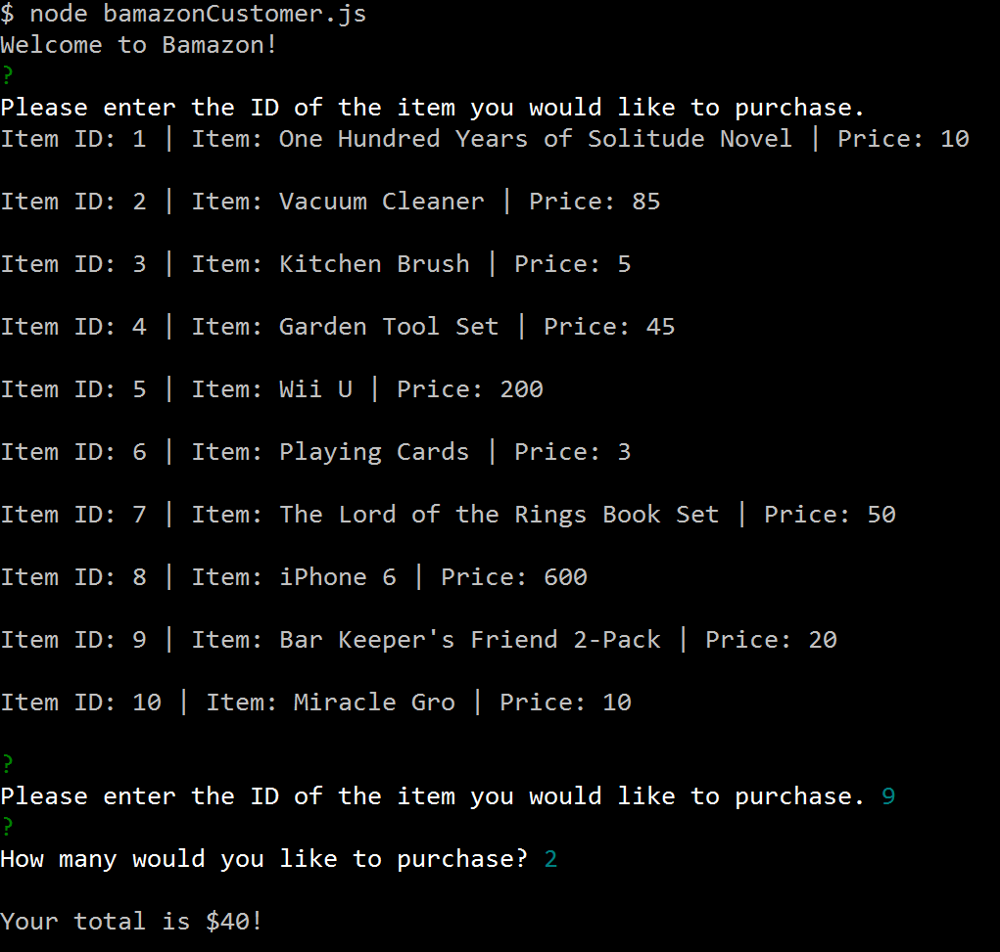
Customers can enter the ID of the item they wish to purchase and the quantity. If there is a sufficient number of that item in stock, the customer's total will be provided. If not, the customer will be told that there aren't enough and they will be directed back to the list of items available. The database will be updated:
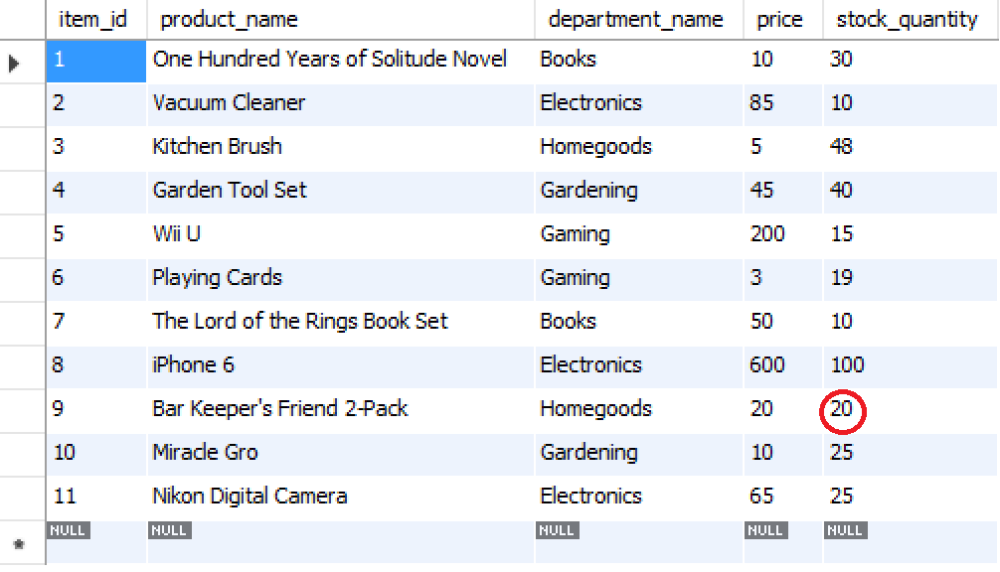
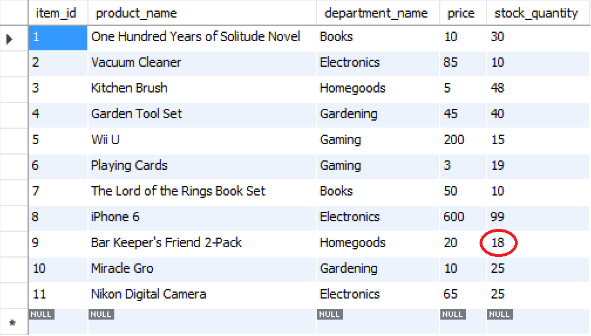

##Manager View
Manager view has four functions: view inventory, view low inventory, replenish stock, and add new items. The manager is immediately given these four options:
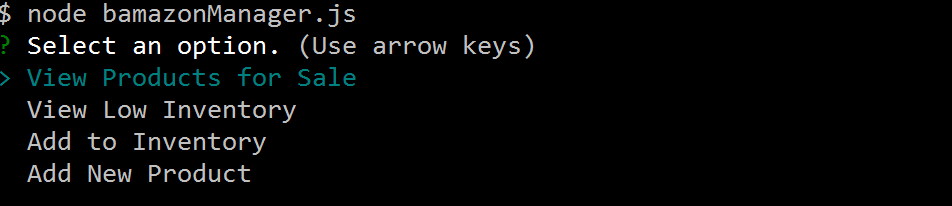
The 'view inventory' function is similar to the customer view, but the manager is given all information about each item:
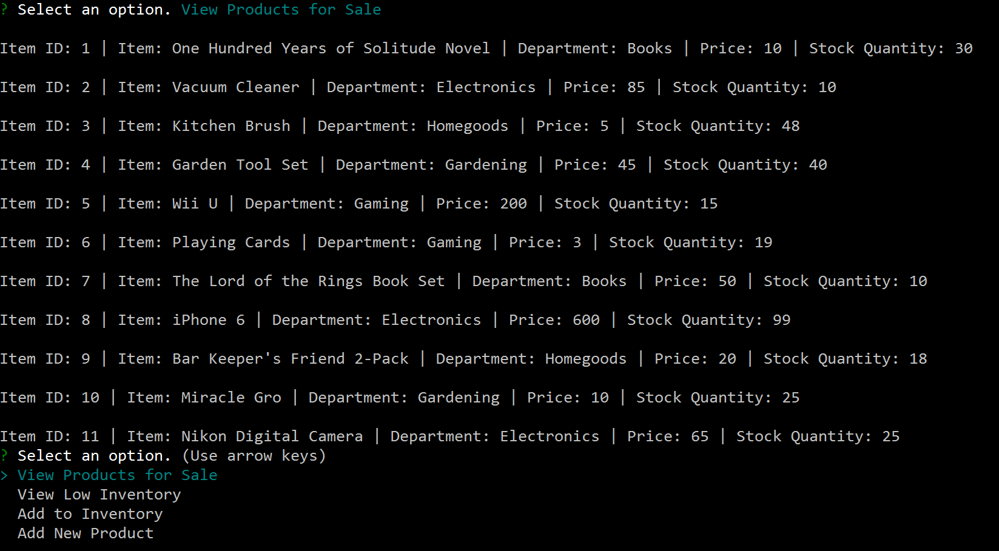
The 'view low inventory' function will display all items that currently have five or fewer in stock. If everything has over five items, the display below will show:
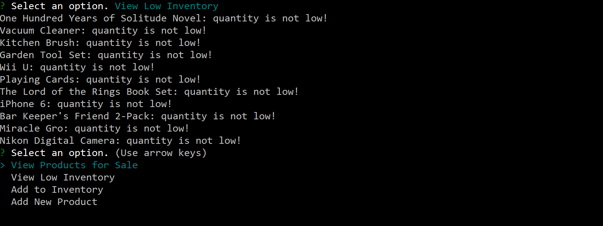
The 'replenish stock' function allows the manager to replenish the stock of any item in the inventory.
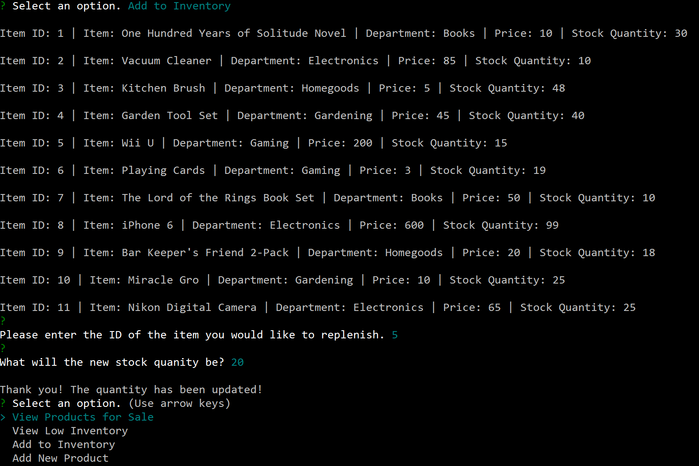
The amount is updated in the database:

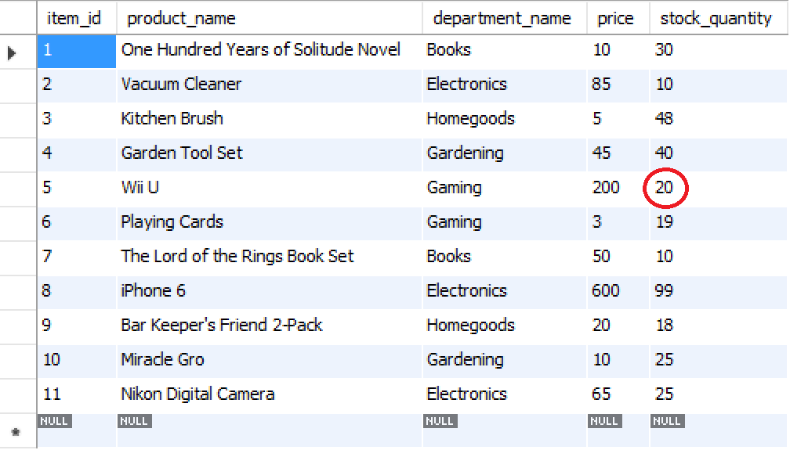
The 'add new item' function allows the manager to add an entirely new item to the database of items.
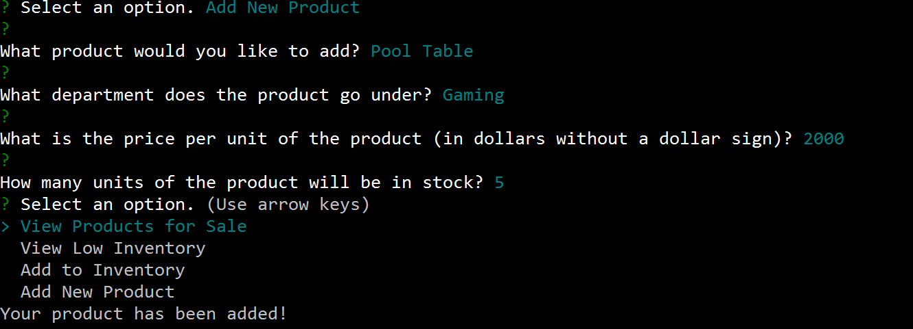
The item will be added to the inventory in the database:
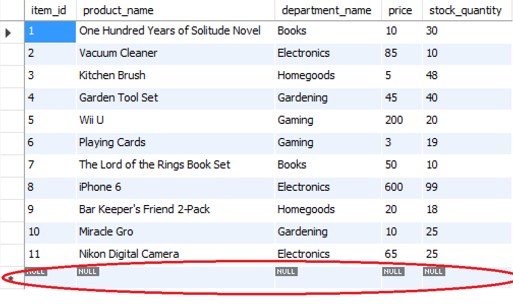
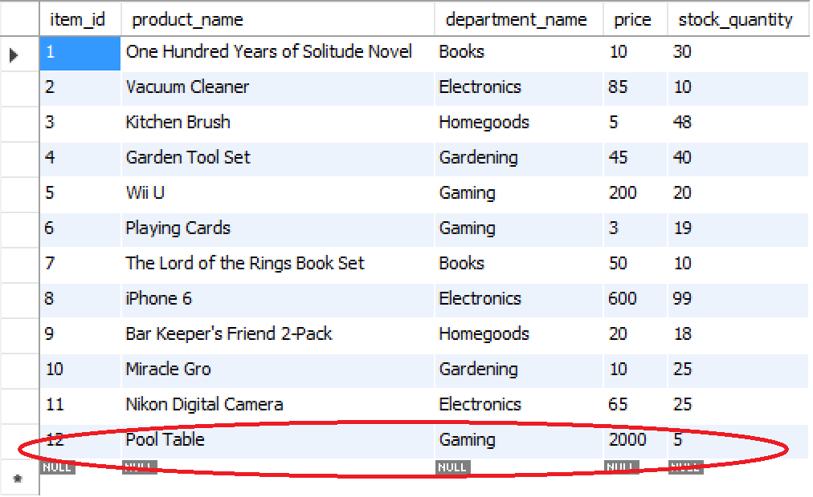